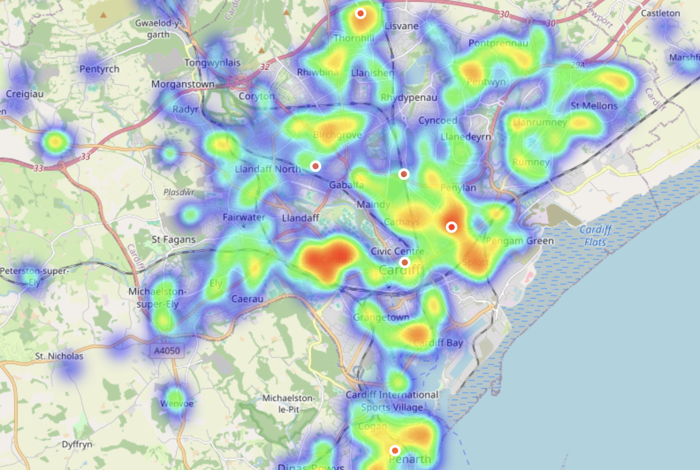
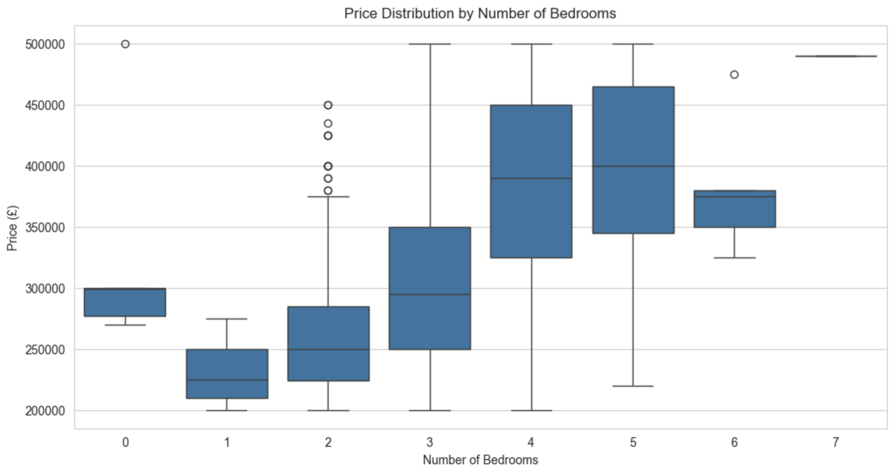
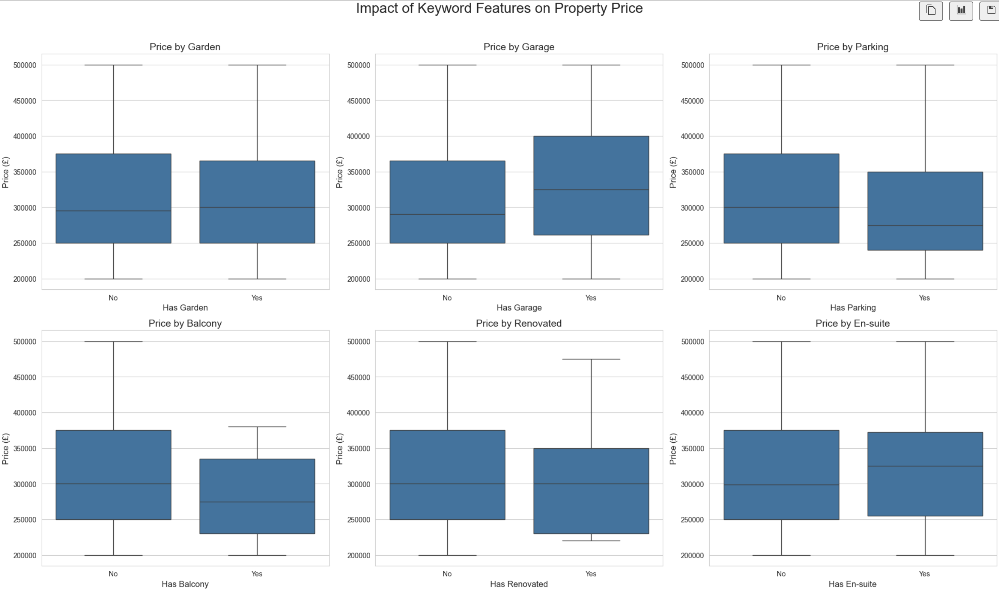
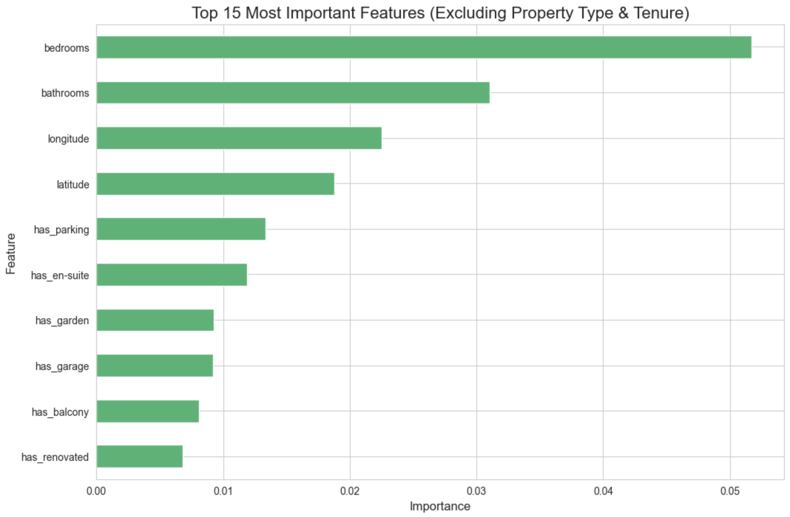

# 🏠 Cardiff Property Price Predictor

An end-to-end data science project that predicts property prices in Cardiff, UK. The project scrapes real-world data from Rightmove, cleans and processes it, and trains a machine learning model to make predictions. The final model is deployed as an interactive web application using Streamlit.

**Live Application URL:** _Click here to view the deployed app!_ 👈

---

## 🚀 Key Features

- **Automated Data Scraping:** A robust Python scraper built with `requests` and `BeautifulSoup` extracts clean data directly from the hidden JSON data layer on Rightmove's website.

- **Data Cleaning & Feature Engineering:** A comprehensive pipeline using `pandas` cleans the data and engineers new features from the property summaries (e.g., `has_garden`, `has_garage`).

- **Insightful Data Visualization:** In-depth analysis and visualizations using `matplotlib`, `seaborn`, and `folium` to tell a story about the Cardiff property market.

- **Machine Learning Modeling:** Compares a baseline Linear Regression model with an advanced XGBoost model. Includes analysis of feature importance and model errors.

- **Interactive Web Application:** The final XGBoost model is deployed in a user-friendly application built with Streamlit, allowing anyone to get a live price prediction.

---

## 📊 Data Analysis and Visualizations

### Geospatial Price Map
To understand the geographical distribution of prices, an interactive map was created using Folium. The map uses a heatmap to show price intensity across different areas of the city. The "hotter" (red/yellow) areas signify a higher concentration of expensive properties, clearly identifying the most valuable neighborhoods.



### Price by Number of Bedrooms
A boxplot was used to visualize the relationship between the number of bedrooms and property price. This clearly shows a strong positive correlation: as the number of bedrooms increases, the median price and the price range also increase significantly



### Impact of Keywords on Price
By engineering features from the property descriptions, we can analyze how keywords like "garden" or "garage" affect the average price. This plot shows the difference in average price for properties that have these features versus those that don't.



---

## 🤖 Model Performance and Insights

Two models were trained to predict property prices. The final XGBoost model significantly outperformed the simple baseline.

### Linear Regression (Baseline)
- **Mean Absolute Error:** £51,264.98 
- **R-squared:** 0.38

### XGBoost (Final Model)
- **Mean Absolute Error:** £38,110.80
- **R-squared:** 0.62

### Feature Importance
The chart below shows which factors the XGBoost model considered most important when making a prediction. As expected, location (latitude and longitude) and the number of bedrooms are the most influential features.



---

## ⚙️ How to Run This Project Locally

### Prerequisites
- Python 3.9+
- A virtual environment tool like `venv`

### Setup

**Clone the repository:**
```bash
git clone https://github.com/your-username/cardiff-property-predictor.git
cd cardiff-property-predictor```

**Create and activate a virtual environment:**
```bash
python3 -m venv venv
source venv/bin/activate```

**Install the required packages:**
```bash 
pip install -r requirements.txt```

**Run the Streamlit application:**
```bash 
streamlit run app.py```